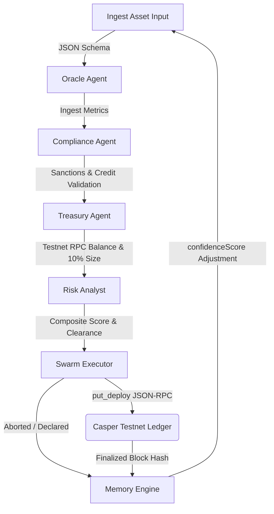

# NexusVault: Autonomous Multi-Agent RWA Underwriting & Capital Deployment Swarm

NexusVault is a next-generation decentralized asset underwriting protocol built for the **Casper Network**. It introduces a collaborative swarm of five specialized AI agents that collectively ingest real-world asset (RWA) metrics, screen regulatory whitelists and sanction blacklists, audit reserve funds via live Casper Testnet RPC calls, compute dynamic risk scores, and settle automated capital allocation transactions programmatically on-chain using Odra smart contracts.

---

## 🏗️ Swarm Architecture & Data Flow

The NexusVault pipeline coordinates specialized agents in a sequence, updating a persistent local feedback loop after each block finalization:



### Swarm Cluster Modules

1. **Oracle Agent** ([oracle_agent.ts](file:///c:/Users/arvin/OneDrive/Desktop/casper/agents/src/oracle_agent.ts)): Feeds tokenized RWA parameters (valuations, down payments, local market index trend multipliers, origin country codes, and borrower credit scores).
2. **Compliance Agent** ([compliance_agent.ts](file:///c:/Users/arvin/OneDrive/Desktop/casper/agents/src/compliance_agent.ts)): Validates country whitelists, runs name matching against sanction indexes, and checks credit score minimum qualifiers (600 FICO).
3. **Treasury Agent** ([treasury_agent.ts](file:///c:/Users/arvin/OneDrive/Desktop/casper/agents/src/treasury_agent.ts)): Interacts directly with Casper Testnet node RPC endpoints to query live wallet balances, dynamically sizing allocation capital to exactly 10% of total reserves (capped at 500 CSPR).
4. **Risk Analyst** ([risk_analyst.ts](file:///c:/Users/arvin/OneDrive/Desktop/casper/agents/src/risk_analyst.ts)): Computes a composite risk index from LTV, interest rates, and compliance parameters. Dynamically scales down the maximum risk tolerance threshold if the swarm confidence is compromised.
5. **Swarm Executor** ([swarm_executor.ts](file:///c:/Users/arvin/OneDrive/Desktop/casper/agents/src/swarm_executor.ts)): Signs, packages, and broadcasts transaction payloads to the target contract.
6. **Memory Engine** ([memory_engine.ts](file:///c:/Users/arvin/OneDrive/Desktop/casper/agents/src/memory_engine.ts)): Manages state persistence in `history_db.json`, adjusting confidence levels (+5 for success, -15 for failure) dynamically.

---

## 🛠️ Casper Network Smart Contract Integration

NexusVault utilizes an **Odra-framed Rust smart contract** deployed to the Casper Testnet:

- **Contract Name:** `NexusVault`
- **On-Chain Hash Address:** `hash-184250acf2daff732850c0e14b582fcfaf0c1b7b2f60248c0f362e4d63b8f843`
- **Target Method:** `deploy_capital(asset_id: String, amount: U256)`
- **Gas Budget:** Standard execution payment of 15 CSPR (`15,000,000,000` Motes).

---

## 💡 Key Technological Integration Highlights

- **Casper Network Integration**: Direct integration with Casper RPC JSON endpoints using state root hash lookups and URef purse balance resolving. Transactions are broadcasted using `put_deploy` signed directly via Ed25519 client-side keypairs.
- **Model Context Protocol (MCP) Design Patterns**: Follows modular context sharing where each agent exposes clean, strictly typed input/output interfaces, enabling agents to act as independent microservices or tools in a larger agentic framework.
- **Adaptive Memory Learning**: Continuous learning feedback loops. A series of block rejects/reverts scales back the risk threshold limit of the swarm to restrict capital exposure. Subsequent successful blocks restore confidence and expand allocations.

---

## 🚀 Installation & Launch Guide

Follow these steps to run the NexusVault contract builds and multi-page dashboard server locally:

### Prerequisites
- Node.js (v18+)
- Rust (nightly-2024-01-09 or latest, if recompiling contracts)
- `wasm-strip` (for WASM size optimizations)

### 1. Build and Compile Smart Contracts (Optional)
If you wish to compile the smart contracts:
```bash
# Navigate to contract workspace root
cd contracts

# Run standard Odra compilation command
cargo odra build
```

### 2. Install Dependencies & Build Agents
```bash
# Navigate to agents workspace root
cd agents

# Install required node modules
npm install

# Compile TypeScript files
npm run build
```

### 3. Start the Web Console Server
NexusVault runs an Express API server hosting the dashboard telemetry on port 3000:
```bash
# Launch server
npm run dashboard
```
Open **[http://localhost:3000](http://localhost:3000)** in your browser to experience the storytelling Landing Page, neon animated architecture diagrams, and the multi-agent control center.

---

## 🧑‍💻 Development Workspace Structure

```
├── contracts/                  # Odra Smart Contract Workspace
│   ├── src/                    # Rust contract logic
│   ├── bin/                    # Build schemas & install tools
│   └── Odra.toml               # Odra manifest configuration
└── agents/                     # Swarm Node Orchestrator
    ├── src/                    # Swarm TypeScript source files
    ├── public/                 # HTML UI layouts & styles
    ├── history_db.json         # Local memory persistence database
    └── package.json            # Node project configuration
```
